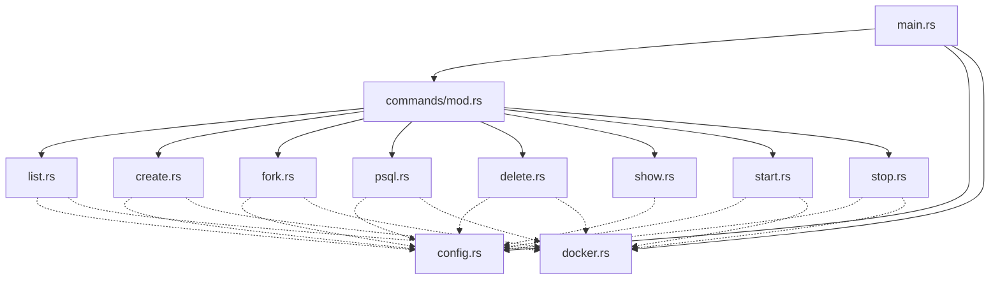

# 🐘 Paagan 

`paagan` is a lightweight CLI tool to manage multiple PostgreSQL versions and instances locally using Docker. 

The primary motivation for this project is to have a developer experience similar to **CloudNativePG (CNPG)** but running locally on a development machine. It simplifies tasks like running specific PostgreSQL versions, managing multiple isolated databases, and performing **Point-In-Time Recovery (PITR)** through forking.

## Features

- **Multi-Version Support:** Run any PostgreSQL version (including 15, 16, 17, and the new 18+ structure).
- **Isolation:** Each instance gets its own data, WAL archive, and backup directories.
- **Dynamic Port Management:** Automatically assigns and remembers unused ports for each instance.
- **Local PITR:** Fork an existing database to a new instance at a specific point in time.
- **Cloud-Native Logic:** Mimics production-grade database management patterns (WAL archiving, base backups).
- **Portable:** Automatically handles UID/GID mapping to ensure Docker has correct permissions on your local filesystem.

## Architecture



## Installation

Ensure you have Rust and Docker installed.

```bash
cargo build --release
cp target/release/paagan /usr/local/bin/ # or wherever you want it
```

*Note: Ensure your `DOCKER_HOST` is correctly set if you are using Colima or a non-standard Docker socket.*

## Directory Structure

All configuration and data are stored in `~/.paagan`:
- `instances.json`: Metadata for all managed instances.
- `instances/<name>/data`: PostgreSQL data directory.
- `instances/<name>/archive`: WAL archive directory.
- `instances/<name>/backups/<timestamp>`: Base backups used for forking and as `compact` retention anchors.

## Commands

### `list`
Lists all database containers managed by `paagan` along with their versions, ports, and current Docker status.
```bash
paagan list
```

### `create`
Creates a new PostgreSQL instance. It pulls the required image, sets up the directory structure, and starts the container.
```bash
paagan create --version 18-alpine my-db
```

#### Custom images and `shared_preload_libraries`

You can run any PostgreSQL-compatible image (extension bundles like
[`searchbase`](https://github.com/vagmi/searchbase), pgvector builds, etc.) by
passing `--image` and selecting `--init-mode cnpg`. The `cnpg` mode runs an
explicit `initdb` step and invokes `postgres -D ...` directly, mirroring how
CloudNativePG-style images expect to be started; the default `standard` mode
continues to use the official `postgres` entrypoint.

`--shared-preload-libraries` is passed through as `-c shared_preload_libraries=...`,
needed for extensions like `pg_textsearch` that must be loaded at server start.

```bash
paagan create \
  --image ghcr.io/vagmi/searchbase:latest \
  --shared-preload-libraries pg_textsearch \
  --init-mode cnpg \
  searchdb

# Then create the bundled extensions in your database:
paagan psql searchdb
# postgres=# CREATE EXTENSION vector;
# postgres=# CREATE EXTENSION vectorscale CASCADE;
# postgres=# CREATE EXTENSION pg_textsearch;
```

The image, init mode, and `shared_preload_libraries` are persisted with the
instance, so `start` (after a manual container removal) and `fork` will reuse
the same configuration automatically.

### `start` / `stop`
Starts or stops an existing database instance. `start` will recreate the container if it was manually removed, ensuring your data is always accessible.
```bash
paagan stop my-db
paagan start my-db
```

### `psql`
Opens an interactive `psql` session to the specified instance.
```bash
paagan psql my-db
```

### `show`
Shows detailed information about an instance, including the connection string and data directory paths.
```bash
paagan show my-db
```

### `fork`
Creates a new instance from an existing one. If `--at` is provided, it performs a **Point-In-Time Recovery (PITR)**.
```bash
# Direct fork
paagan fork source-db forked-db

# Fork to a specific timestamp (PITR)
paagan fork --at "2026-03-10 14:30:00+00" source-db recovery-db
```
PITR restores the newest base backup taken at or before `--at` and replays WAL
from there. Timestamps without an offset are treated as UTC. A target older
than the oldest kept backup fails with the earliest restorable time.

### `compact`
Every instance archives WAL continuously, so `archive/` grows without bound.
`compact` takes a fresh base backup, then removes base backups older than
`--retain` (default `7d`) and every archived WAL segment older than the oldest
kept backup.

By default the newest backup *older* than `--retain` is also kept. It anchors
the start of the window, so you can always fork to any point in the last
`--retain`, however often compaction runs. Disk use is therefore up to
`--retain` plus one compaction interval of WAL. `--strict` deletes that
backup too: nothing older than `--retain` survives, but the restorable window
can be shorter. `show` prints the current window and archive size.
```bash
# See what would be removed (no backup taken, nothing deleted)
paagan compact --dry-run my-db

# Keep (at least) one week of history
paagan compact my-db

# Compact every running instance, keeping exactly 3 days at most
paagan compact --all --retain 3d --strict
```

#### Scheduling
`--schedule <cron>` registers the compaction with the OS scheduler (launchd on
macOS, systemd user timers on Linux, Task Scheduler on Windows) instead of
running it now. paagan itself doesn't stay running. Output is appended to
`~/.paagan/logs/<job>.log`, and `show` lists an instance's schedules.
```bash
paagan compact --schedule "0 3 * * *" my-db       # daily at 03:00 local time
paagan compact --schedule @daily --all --retain 3d
paagan compact --unschedule my-db                 # or: --unschedule --all
```
The job runs the `paagan` binary you scheduled it from, with your current
`PATH` and `DOCKER_*` variables. Re-run `--schedule` after moving the binary.
`delete` removes an instance's schedule.

### `delete`
Removes the database instance, its Docker container, and all associated data on disk.
```bash
paagan delete my-db
```

## How Forking Works (The CNPG way)
1. `paagan` triggers a `pg_basebackup` on the source instance (or, for PITR, picks the newest existing backup taken before the target).
2. It ensures all pending WAL logs are archived.
3. It extracts the backup into the new instance's data directory.
4. It configures a `restore_command` to pull logs from the source's archive.
5. If a timestamp is provided, it sets `recovery_target_time`.
6. The new instance starts in recovery mode, reaches the target, promotes itself, and becomes a standalone database.
